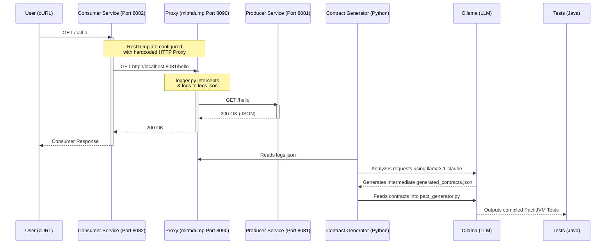

# Prism Contract Generator

Prism is an intelligent, zero-touch API Contract Testing automation tool. It seamlessly observes HTTP traffic between a Consumer and Producer microservice and dynamically generates **Pact JVM** consumer-driven contract tests using Large Language Models (LLMs) via Ollama.

## 🏗️ Architecture

Below is the end-to-end architecture of the platform:



### Components

1. **Producer Service (`/producer`)**: A standard Java 21 Spring Boot application exposing several REST endpoints (`/hello`, `/data`).
2. **Consumer Service (`/consumer`)**: A standard Spring Boot application that acts as an API client, translating incoming calls manually to the Producer. Its `RestTemplate` is hardcoded to route out-bound HTTP traffic through a proxy server to allow passive monitoring.
3. **Mitmproxy Interceptor (`/contract/logger.py`)**: A Python-based mitmdump add-on that passively sniffs all API interactions occurring between the Consumer and Producer and dumps them sequentially into `logs.json`.
4. **LLM Contract Generators (`/contract/*.py`)**:
   - `llm_contract_generator.py`: Parses the raw API intercepts to establish the underlying structure of the REST endpoints.
   - `pact_generator.py`: Directly prompts an Ollama instance to write syntactically correct, pure Java 21 JUnit 5 Pact interactions avoiding common pitfalls (like nested classes or imaginary clients).

---

## ⚙️ Prerequisites

- **Java 21** & **Maven**
- **Python 3.10+** (with the `ollama` package installed)
- **Ollama** running locally with the `incept5/llama3.1-claude` model.
- **mitmproxy** installed via standard pip or binaries (`pip install mitmproxy`).

---

## 🚀 Setup & Execution Guide

### 1. Start the Network Monitor (Proxy)

First, start the passive listener to record all API interactions:

```bash
cd contract
mitmdump --listen-port 8090 -s logger.py
```

### 2. Start the Microservices

In two separate terminal windows, spin up our Java backends:

**Start Producer (Runs on Port 8081):**

```bash
cd producer
./mvnw spring-boot:run
```

**Start Consumer (Runs on Port 8082):**

```bash
cd consumer
./mvnw spring-boot:run
```

_(The Consumer is configured mathematically to intercept its own RestTemplate traffic and route it out through `http://127.0.0.1:8090`)_

### 3. Generate Traffic 🚦

To generate contracts, we need API traffic. Use `cURL` or Postman to interact with the **Consumer Service** (which then queries the Producer):

```bash
# GET Request
curl http://localhost:8082/call-a

# POST Request
curl -X POST http://localhost:8082/send-to-a -H "Content-Type: application/json" -d "{\"item\": \"Apple\"}"
```

_Verify that `contract/logs.json` begins filling up with the intercepted JSON strings._

### 4. Run the AI Contract Generators

Once sufficient API traffic exists, use the Python pipeline located in the `/contract` folder to build the tests:

```bash
cd contract

# Step 1: Synthesize API schemas from logs.json -> generated_contracts.json
python llm_contract_generator.py

# Step 2: Use Ollama to convert JSON contracts into valid JUnit 5 Pact JVM Java code
python pact_generator.py
```

This will deposit `.java` text artifacts inside `contract/tests/`. Copy these test classes into your `consumer/src/test/java/...` classpath.

### 5. Validate the Pact Contracts!

Finally, navigate back to your consumer architecture and run Maven to see your locally built Consumer-Driven Contract properly fail or succeed against Pact validations!

```bash
cd consumer
mvn clean test
```

````
Start the server using uvicorn main:app --reload from the contract directory.
Ensure logs.json and a running local instance of Ollama on port 11434 are available.
Send a POST request to http://localhost:8000/consumer (e.g. using curl or Postman).
Verify that the server returns a valid .zip file containing .java Pact tests.```
````
