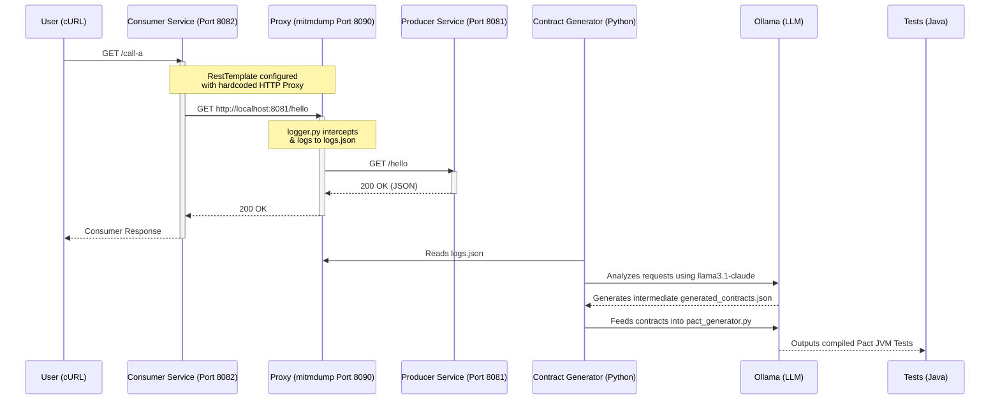

# Prism Contract Generator

Prism is an intelligent, zero-touch API Contract Testing automation tool. It seamlessly observes HTTP traffic between a Consumer and Producer microservice and dynamically generates **Pact JVM** consumer-driven contract tests using Large Language Models (LLMs) via Ollama.

## 🏗️ Architecture

Below is the end-to-end architecture of the platform:



### Components

1. **Producer Service (`/producer`)**: A standard Java 21 Spring Boot application exposing several REST endpoints (`/hello`, `/data`).
2. **Consumer Service (`/consumer`)**: A standard Spring Boot application that acts as an API client, translating incoming calls manually to the Producer. Its `RestTemplate` is hardcoded to route out-bound HTTP traffic through a proxy server to allow passive monitoring.
3. **Mitmproxy Interceptor (`/contract/logger.py`)**: A Python-based mitmdump add-on that passively sniffs all API interactions occurring between the Consumer and Producer and dumps them sequentially into `logs.json`.
4. **LLM Contract Generators (`/contract/*.py`)**:
   - `llm_contract_generator.py`: Parses the raw API intercepts to establish the underlying structure of the REST endpoints.
   - `pact_generator.py`: Directly prompts an Ollama instance to write syntactically correct, pure Java 21 JUnit 5 Pact interactions avoiding common pitfalls (like nested classes or imaginary clients).

---

## ⚙️ Prerequisites

- **Java 21** & **Maven**
- **Python 3.10+** (with the `ollama` package installed)
- **Ollama** running locally with the `incept5/llama3.1-claude` model.
- **mitmproxy** installed via standard pip or binaries (`pip install mitmproxy`).

### Setting up Ollama
To generate the AI-based contracts, you must have Ollama installed and running with the required model:
1. Download and install Ollama from [ollama.com](https://ollama.com/download)
2. Open your terminal and pull the specific fine-tuned model used by the generators:
   ```bash
   ollama run incept5/llama3.1-claude
   ```
   *(This will download the model. You can exit the prompt once it finishes, as the Ollama background service will stay active on port `11434`)*
   
### Setting up Pact Broker (Docker)
To publish contracts and dynamically verify Provider tests, you need a running instance of the Pact Broker. This process spins up a PostgreSQL db and the broker service on port 9292:

1. Start the PostgreSQL Database container:
   ```bash
   docker run --name pactbroker-db -e POSTGRES_PASSWORD=ThePostgresPassword -e POSTGRES_USER=admin -e PGDATA=/var/lib/postgresql/data/pgdata -v /var/lib/postgresql/data:/var/lib/postgresql/data -d postgres
   ```
2. Enter the Database container:
   ```bash
   docker exec -it pactbroker-db psql -U admin
   ```
3. Run the following SQL commands to create the database and user:
   ```sql
   CREATE USER pactbrokeruser WITH PASSWORD 'TheUserPassword';
   CREATE DATABASE pactbroker WITH OWNER pactbrokeruser;
   GRANT ALL PRIVILEGES ON DATABASE pactbroker TO pactbrokeruser;
   \q
   ```
4. Start the Pact Broker container:
   ```bash
   docker run --name pactbroker --link pactbroker-db:postgres -e PACT_BROKER_DATABASE_USERNAME=pactbrokeruser -e PACT_BROKER_DATABASE_PASSWORD=TheUserPassword -e PACT_BROKER_DATABASE_HOST=postgres -e PACT_BROKER_DATABASE_NAME=pactbroker -d -p 9292:9292 pactfoundation/pact-broker
   ```
   *(The Broker is now running at `http://localhost:9292`)*

### 📦 Required Maven Configuration

If you are setting this up in a fresh Java environment, ensure your `consumer/pom.xml` contains the following dependency and plugin for JUnit 5 Pact testing and broker publishing:

**Pact Consumer Dependency:**
```xml
<dependency>
    <groupId>au.com.dius.pact.consumer</groupId>
    <artifactId>junit5</artifactId>
    <version>4.6.15</version>
    <scope>test</scope>
</dependency>
```

**Pact Provider Plugin (for publishing to the Broker):**
```xml
<plugin>
    <groupId>au.com.dius.pact.provider</groupId>
    <artifactId>maven</artifactId>
    <version>4.6.10</version>
    <configuration>
        <pactBrokerUrl>http://localhost:9292</pactBrokerUrl>
        <projectVersion>${project.version}</projectVersion>
    </configuration>
</plugin>
```

---

## 🚀 Setup & Execution Guide

### 1. Start the Network Monitor (Proxy)

First, start the passive listener to record all API interactions:

```bash
cd contract
mitmdump --listen-port 8090 -s logger.py
```

### 2. Start the Microservices

In two separate terminal windows, spin up our Java backends:

**Start Producer (Runs on Port 8081):**

```bash
cd producer
./mvnw spring-boot:run
```

**Start Consumer (Runs on Port 8082):**

```bash
cd consumer
./mvnw spring-boot:run
```

_(The Consumer is configured mathematically to intercept its own RestTemplate traffic and route it out through `http://127.0.0.1:8090`)_

### 3. Generate Traffic 🚦

To generate contracts, we need API traffic. Use `cURL` or Postman to interact with the **Consumer Service** (which then queries the Producer):

```bash
# GET Request
curl http://localhost:8082/call-a

# POST Request
curl -X POST http://localhost:8082/send-to-a -H "Content-Type: application/json" -d "{\"item\": \"Apple\"}"
```

_Verify that `contract/logs.json` begins filling up with the intercepted JSON strings._

### 4. Generate Consumer Contract Tests

Once sufficient API traffic exists, you have two ways to generate your Java Pact Tests:

#### Option A: One-Click FastAPI Server (Recommended)
1. Start the generation server:
   ```bash
   cd contract
   uvicorn main:app --reload
   ```
2. Make sure Ollama is running locally on port 11434.
3. Send a POST request to generate and download the contracts:
   ```bash
   curl -X POST http://localhost:8000/consumer --output contracts_tests.zip
   ```
4. Unzip `contracts_tests.zip` and copy the Java files into your `consumer/src/test/java/...` classpath.

#### Option B: Manual Python CLI
Alternatively, run the pipeline scripts manually:
```bash
cd contract
# 1. Synthesize API schemas from logs.json -> openapi.json
python openapi_generator.py

# 2. Extract specific endpoints -> generated_contracts.json
python llm_contract_generator.py

# 3. Code-gen valid JUnit 5 Pact JVM Java code -> tests/
python pact_generator.py
```

### 5. Generate Provider Contract Tests

Prism can also generate Provider Verification tests dynamically from the Pact Broker, including auto-generating complete `@State` methods!
1. Make sure your Pact Broker is running (e.g., `http://localhost:9292`). *Note: Set `PACT_BROKER_URL` environment variable if deployed in the cloud.*
2. Run the Provider Generator script:
   ```bash
   cd contract
   python provider_pact_generator.py --provider api-service --all
   ```
   *Available flags: `--provider <name>`, `--consumer <name>`, `--all`*
3. The AI will output a fully configured Spring Boot Provider Test into `contract/tests_provider/`. Copy this into your Producer's test classpath.

### 6. Run & Publish the Consumer Tests

Once you have copied the generated Java tests into your Consumer project (`consumer/src/test/java/...`), run them using Maven:

```bash
cd consumer
mvn clean test
```

If the tests pass successfully against your AI-generated mock scenarios, the Pact JVM framework will automatically generate the raw Pact JSON files inside `consumer/target/pacts`.

To upload these freshly generated contracts to the Pact Broker so the Provider can verify them:
```bash
mvn pact:publish
```
*(You should now see the contracts appear in the UI at `http://localhost:9292`)*

### 7. Run the Provider Verification Tests

Once the contracts are published to the broker and you have generated the Spring Boot Provider tests using the AI (Step 5):

```bash
cd producer
mvn clean test
```

The Provider tests will dynamically fetch the contracts from your Pact Broker, start up your running service on a random port, and verify that your real backend implementation adheres strictly to the pacts you just published!
